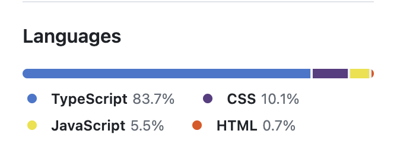
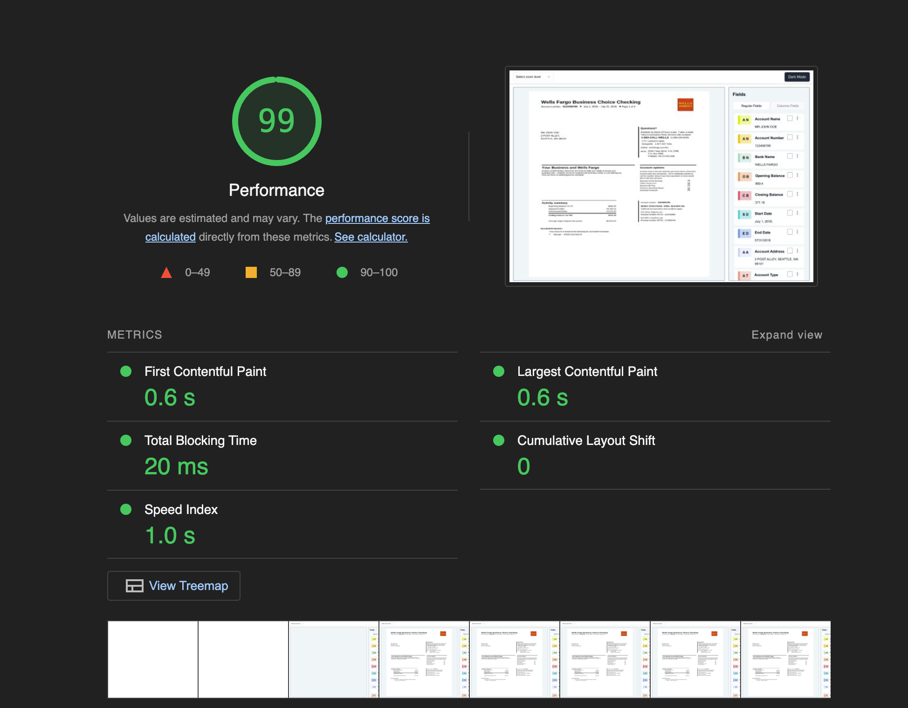

# Docsumo

This is react application built with template provided by **React + TypeScript + Vite** 
It is available at https://docsumo-one.vercel.app/

## Libraries Used:

- [tailwindcss](https://tailwindcss.com/) : A utility-first CSS framework packed with classes like flex, pt-4, text-center and rotate-90. It comes with a design system that helps maintain consistency across various design requirements like padding, spacing, and so forth. Hence, speeding up the development process by writing less css.

- [shadcn/ui](https://ui.shadcn.com/) : has been used as component library to use various component like dropdown, select, modals, buttons. It has been selected because of its easy customization. Unlike other libraries, where the components are served via node_modules, its components can be directly copied and pasted into our own source code.

## Project Structure:

This project has a fairly simple folder structure.

- All of the components are inside `/src/components`. It has an `index.ts` file while exports all of the components.

- The utils have been distributed across different folders.

  - `src/consts` - for storing constants
  - `src/lib` - for storing util functions

- Since we are using typescript. We have two folder for enums and types.
  - `src/enums` - for storing enums
  - `src/types` - for storing types

### Functional Requirements

1. **Right Sidebar :**

- [x] Implement a right sidebar that lists all fields extracted from the document, using data from section.json.

- [x] Each field should display its title and value.
- [x] There is a badge on the left based on the field title's initial letters with a random background.
- [x] Checkbox is mandatory feature to select the fields for the confirm action
- [x] The more menu icon will have a remove option where the field can be removed ( no api calls required just to manage at the store/state level)
- [x] The section.json is a dynamic list so when a new field is added to the list the component should be created in such a way that it can render it dynamically.

2. **Document Previewer :**

- [x] Create an image/document previewer to display field highlights.

- [x] Ensure the image fits the screen on initial page load.
- [x] Implement zoom in/out options with internal scroll (fit, 75%, 100%) from a dropdown field above the document viewer.

3. **Field Highlighting :**

- [x] On checkbox selection or hovering over a section field, highlight specific areas in the document with random or a single color.

- [] When the cursor is positioned near the areas in the document where fields are present, both the field in the document and the field in the sidebar should be highlighted for better interaction(not done).

4. **Review Actions :**

- [x] The bottom of the review section has confirm and select all buttons.

- [x] No API calls are required here. The focus is solely on changing the UI state alone.

  - Select All Button:

    - [x] Add a 'Select All' button for users to select all fields in one click.

  - Confirmation Button:

    - [x] Enable the confirm button at the bottom of the sidebar when more than one field is selected.

    - Confirmation Popup:

      - [x] Upon clicking confirm, display a confirmation popup. Eg.(Are you sure you want to confirm the selected fields?)

      - [x] On confirmation, show an approved modal with a relevant message.Eg.(Fields confirmed and processed successfully!)
      - [x] On cancel, just close the modal.

### Non Functional Requirements (Nice to have but not a mandatory):

1. Optionally include a toggle at the header for dark and light modes (to assess theme experience). 
   Added a button to toggle theme at the top right. 

2. Implement keyboard shortcuts for navigating through each field within the sidebar. 
   Added support for following keyboard shortcuts

- Arrow Up (&uarr;) : To navigate up in the sections list
- Arrow Down (&darr;) : To navigate down in the sections list
- Enter : To select the currently focused list item  

3. Using codebase with typescript support is appreciable. 
   The codebase composition looks like:
    
   
    
4. Run Google Lighthouse with a deployed version  
   Google Lighthouse ran for https://docsumo-one.vercel.app/
   
   View full result at  https://googlechrome.github.io/lighthouse/viewer/?psiurl=https%3A%2F%2Fdocsumo-one.vercel.app%2F&strategy=desktop&category=performance&utm_source=lh-chrome-ext
